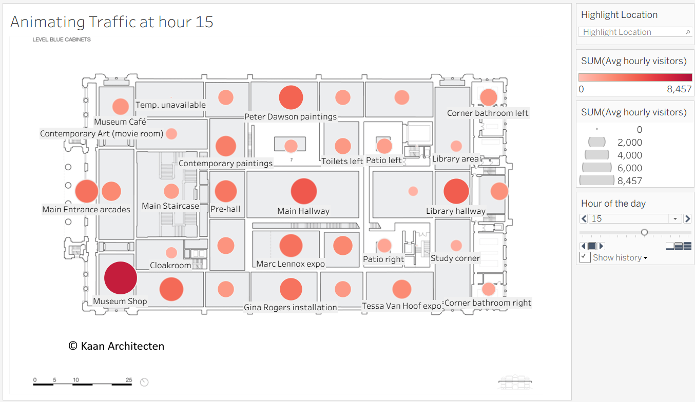
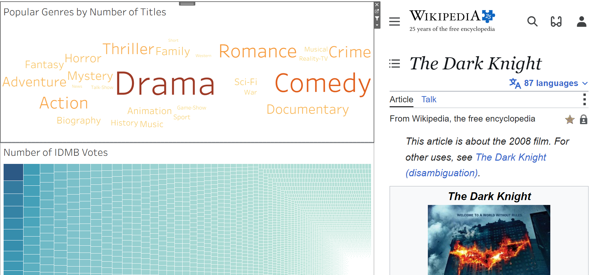

# DataCamp Tableau Projects

A collection of Tableau packaged workbooks completed by Nicholas Fisher while developing data-visualization skills through DataCamp.

## Workbooks

- `basic_maps NF.twbx` — foundational mapping in Tableau
- `Custom Maps Tableau NF.twbx` — custom map techniques, including an animated museum-traffic floor map

  

- `Graphics NF.twbx` — dashboard graphics and visual design
- `Overlay Maps NF.twbx` — layered and overlay maps
- `Tableau NF.twbx` — Tableau visualization exercises
- `Movie Selection Dashboard.twbx` — an interactive movie-selection dashboard combining genre exploration, IMDb voting patterns, and a Wikipedia tooltip panel

  

- `waffle maps, sparklines, and dna charts tool tip graphics NF.twbx` — waffle maps, sparklines, DNA charts, and tooltip graphics

## Opening the files

These files use Tableau's packaged-workbook format (`.twbx`). Download a workbook and open it with Tableau Desktop, Tableau Public, or Tableau Reader. GitHub stores the workbooks but does not render the dashboards interactively in the repository.

## Attribution

These projects were completed as part of DataCamp Tableau coursework. The workbooks reflect my own course work and practice using course-provided instructions and data. DataCamp course videos, lesson text, and answer materials are not included.

## Author

Nicholas Fisher
